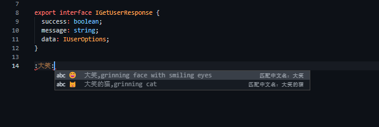

# vscode-plugin-emoji README

这是一个可以在 vscode 中方便插入 emoji 表情的插件，支持一些关键字和中文检索。

## example

输入`:XX:`，就可以搜索 XX 相关的 emoji，进行语法提示：



选择需要的 emoji，会自动进行替换：


## 数据来源

保存 emoji 的相关数据到 plugin 本地中，会不定期更新相关数据

## 自定义

如果想要自己定义一些 emoji 数据，请按照以下格式(可以缺省，image 必填)，对插件进行配置：

```ts
{
  image: string,
  groupName?: string,
  subGroupName?: string,
  nameZh?: string,
  nameEn?: string,
  collections?: string[],
  detail?: {
    unicode_version?: string,
    unicode_code?: string,
    code?: string,
    keywords?: string[]
  }
}

```

示例：

```json
"emojiConfig.emojis": [
  {
    "image": "🤛",
    "nameZh": "朝左的拳头测试关键名字",
    "detail": {
      "code": ":test2_code:",
    }
  }
]
```

## Features

Describe specific features of your extension including screenshots of your extension in action. Image paths are relative to this README file.

For example if there is an image subfolder under your extension project workspace:

\!\[feature X\]\(images/feature-x.png\)

> Tip: Many popular extensions utilize animations. This is an excellent way to show off your extension! We recommend short, focused animations that are easy to follow.

## Requirements

If you have any requirements or dependencies, add a section describing those and how to install and configure them.

## Extension Settings

Include if your extension adds any VS Code settings through the `contributes.configuration` extension point.

For example:

This extension contributes the following settings:

- `myExtension.enable`: enable/disable this extension
- `myExtension.thing`: set to `blah` to do something

## Known Issues

Calling out known issues can help limit users opening duplicate issues against your extension.

## Release Notes

Users appreciate release notes as you update your extension.

### 1.0.0

Initial release of ...

### 1.0.1

Fixed issue #.

### 1.1.0

Added features X, Y, and Z.

---

## Following extension guidelines

Ensure that you've read through the extensions guidelines and follow the best practices for creating your extension.

- [Extension Guidelines](https://code.visualstudio.com/api/references/extension-guidelines)

## Working with Markdown

**Note:** You can author your README using Visual Studio Code. Here are some useful editor keyboard shortcuts:

- Split the editor (`Cmd+\` on macOS or `Ctrl+\` on Windows and Linux)
- Toggle preview (`Shift+CMD+V` on macOS or `Shift+Ctrl+V` on Windows and Linux)
- Press `Ctrl+Space` (Windows, Linux) or `Cmd+Space` (macOS) to see a list of Markdown snippets

### For more information

- [Visual Studio Code's Markdown Support](http://code.visualstudio.com/docs/languages/markdown)
- [Markdown Syntax Reference](https://help.github.com/articles/markdown-basics/)

**Enjoy!**
